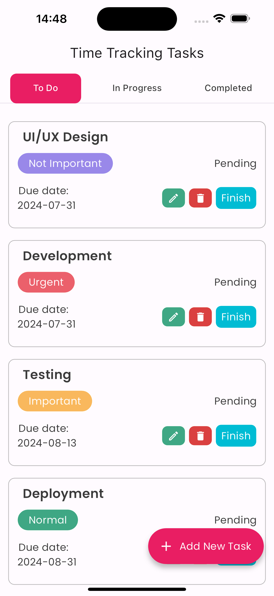
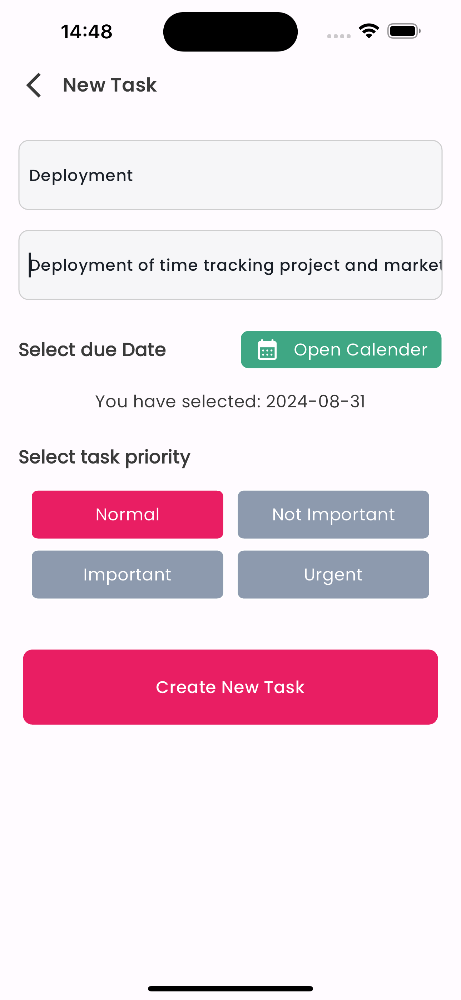
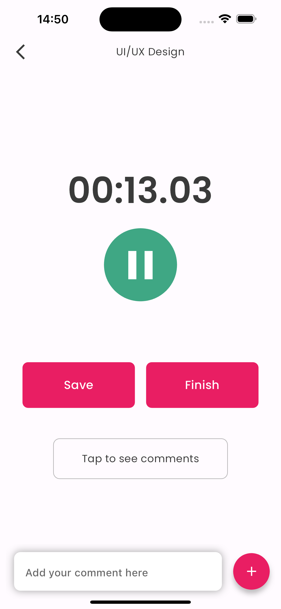
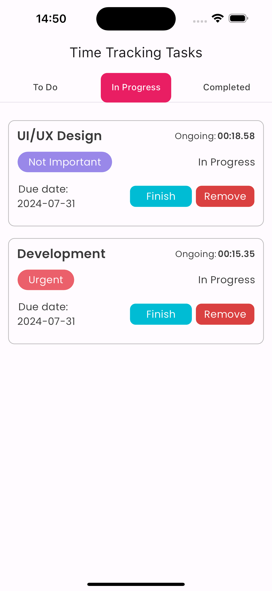
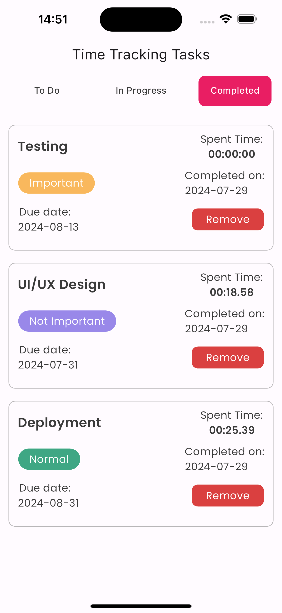
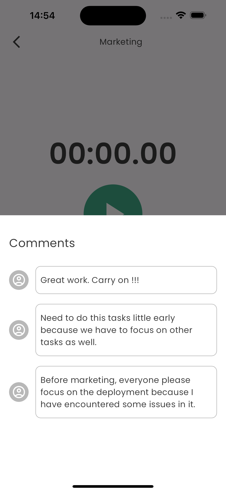
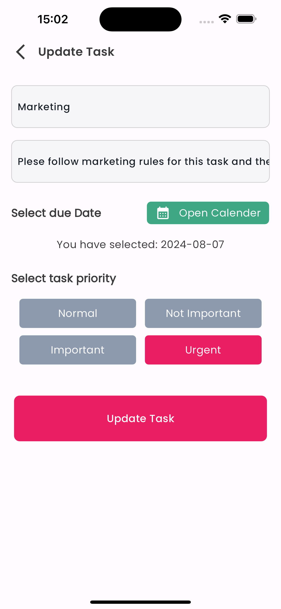
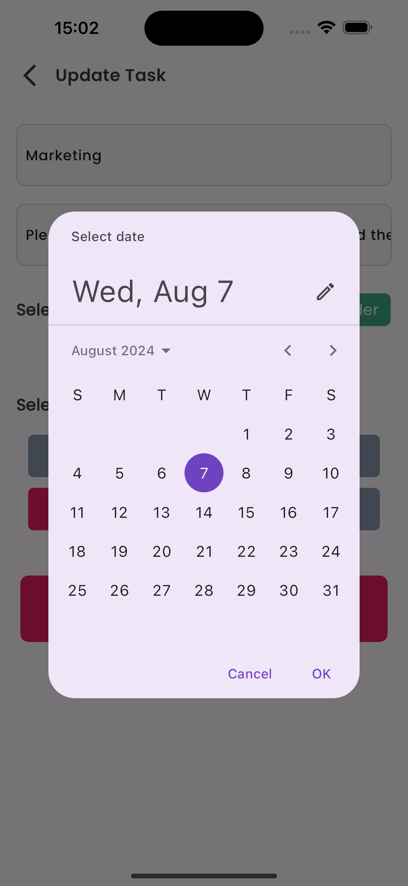

# Time tracking app for tasks

Take-Home Challenge

## Instructions for running this application.
It is recommended to use Android Studio as you code editor but you can also use VSCode.
To complete the iOS deployment steps you will also need to have Xcode installed.
After the successful installation of Android Studio, you have to install Flutter and Dart plugins.
To do so follow the steps mentioned below:
- Start Android Studio.
- Open plugin preferences (Configure > Plugins as of v3.6.3.0 or later).
- Select the Flutter plugin and click Install.
- Click Yes when prompted to install the Dart plugin.
- Click Restart when prompted.
- Open plugin preferences:
  For macOS: Preferences > Plugins on macOS,
  For Linux and Windows: File > Settings > Plugins

The last piece you will need to set up before beginning this project is the set up of an
iOS simulator, Android emulator or some physical device. Once these sets have been completed,
you are ready to start running this application.
After complete setup, you need to clone the repository and run the project.

## Some important link for setup:
Android studio download link: https://developer.android.com/studio/?gclid=CjwKCAjwq_D7BRADEiwAVMDdHjI_Lu5xR1whSMHH-WDMO3x6WDQVbBcZxbhN9h6m9SsT6b_wjmuKkhoCbSwQAvD_BwE&gclsrc=aw.ds
Xcode download link: https://developer.apple.com/xcode/
iOS simulator setup: https://docs.flutter.dev/get-started/install/macos/mobile-ios?tab=download#configure-your-target-ios-device
Android emulator setup: https://docs.flutter.dev/get-started/install/macos/mobile-android?tab=download#configure-your-target-android-device

## About App (features)
Its a time tracking app for tasks with following features:
- To do tasks
- In Progress tasks
- Completed tasks
- Add new task
- Update task
- Remove task
- Comments on each task (user can add and view comments)
- A timer function that allows users to start and stop 
tracking the time spent on each task.
- A history of completed tasks, including the time spent 
on each task and the date it was completed.

## App Structure
- State management (Bloc)
- MVVM Architecture
- Todoist Api for tasks data.
- Firebase for the solutions that are not implemented by the APIs.
  
## App Screenshots
&nbsp;  
    

&nbsp;  
  

&nbsp;  
 

